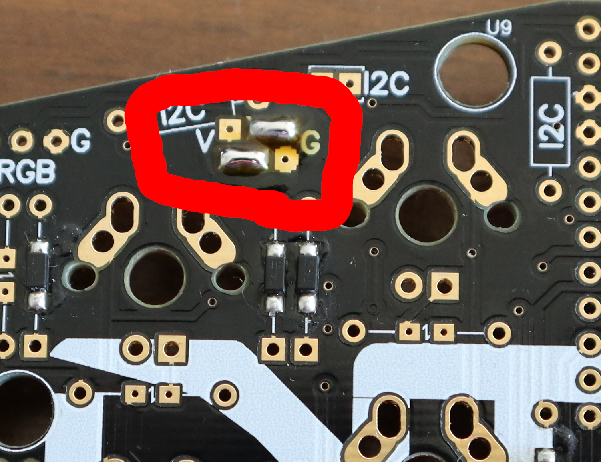

# Ergodash

> Note: Information as of September 2020

## General notes
* I decided to go with a partially assembled PCB to save myself some time (and grief) due to my lack of soldering skills.
* Parts list is for a big thumb cluster with 2 2u keys (LAYOUT_3key_2us in [QMK configurator](https://config.qmk.fm/)), you don't have to use the stabilizers and you don't need them at all if you don't have 2u keys.
* There's no per-key backlight so if you want something like LED layer or caps lock status indication, your best bet is using RGB underglow

## Parts list
> Note: Doesn't include keycaps

| Name | Notes | Total Price |
|:----:|:-----:|:-----------:|
| [PCB](https://falba.tech/product/ergodash-partially-assembled-with-electronics-cables/?v=928568b84963) | Partially assembled and comes with a TRPS cable | 50 € |
| 2x [Pro Micro clone](laskarduino.cz/arduino-leonardo-pro-micro/) | It's said that you can use [Elite-C](https://keeb.io/products/elite-c-low-profile-version-usb-c-pro-micro-replacement-atmega32u4) if you want USB Type C | ~12 € |
| [Case](https://keycapsss.com/keyboard-parts/cases/76/ergodash-acrylic-plate-case?c=12) | Comes with rubber feet | 32.9 € |
| [Switches](https://candykeys.com/product/cherry-mx-blue-plate-m) | 100x, but you only need around 70 | 42 € |
| [Stabilizers](https://candykeys.com/product/genuine-cherry-mx-stabiliser-pack-plate-mount) | 4x 2u, plate mounted | 9 € |
| 24x [Underglow LEDs](https://www.tme.eu/cz/details/ws2812b-v5/diody-led-smd-barevne/worldsemi/) | WS2812B | ~10 € |

#### Parts you need for backlight
> Note: You need a 470RΩ resistor and an LED for each of the backlit keys

> Note: These are metal film resistors, but it shouldn't matter

| Name | Notes | Price per unit |
|:----:|:-----:|:-----------:|
| 2x [Mosfet](https://www.tme.eu/cz/details/irlml6344trpbf/tranzistory-s-kanalem-n-smd/infineon-irf/) | IRLML6344TRPBF | ~0.14 € |
| 2x [1KΩ resistor](https://www.gme.cz/rm-1k-0207-0-6w-1)| 6.3x2.4mm, 0.6W | ~0.11 € |
| [LED](https://www.tme.eu/cz/details/ww03a3swq4-n2/led-diody-tht-3mm/wah-wang-holding/) | Ø 3mm | ~0.11 € |
| [470Ω resistor](https://www.gme.cz/rm-470r-0207-0-6w-1)| 6.3x2.4mm, 0.6W | ~0.11 € |

#### Keycaps
There are not so many sources of dedicated Ergodash keycaps. Here are the ones I've found: 
* [OhKeycaps](https://ohkeycaps.com/collections/dsa-blanks/products/dsa-pink-purple?variant=29211011711087) (small thumb cluster version)
* [FalbaTech](https://falba.tech/product/dsa-keycaps-black-blank-left-right-keyboards-redox-copy/?v=928568b84963)

## Build process

# DO NOT ATTACH THE PRO MICRO BEFORE YOU HAVE ALL THE SWITCHES SOLDERED ON, OTHERWISE YOU WON'T BE ABLE TO ATTACH THE TWO SWITCHES UNDER THE PRO MICRO PROPERLY

I did it a bit differently than the official build guide suggests just because I wanted to be extra sure everything works as expected prior to doing anything that can't be easily reverted.

#### 1. Flashing the Pro Micro

Layout creation, compilation and flashing instructions can be found in the [QMK docs](https://docs.qmk.fm/#/). To reset short the RST and GND pins.

#### 2. Temporarily attaching the Pro Micro

To check that everything works as expected, I attached the Pro Micro to the PCB using tin foil to create a connection between the Pro Micro and the headers.

#### 3. Checking the reset switch

Flash the Pro Micro from your computer, using the reset button instead of shorting the pins directly.

#### 4. Checking all the keys

Open [QMK Configurator test](https://config.qmk.fm/#/test) and short the pins under each switch using tweezers, a piece of wire or anything else conductive. Keep in mind that not all keys will be registered (the exceptions include QMK layer switching keys).

#### 5. Underglow

> Note: for ungerglow to work, you need to have `RGBLIGHT_ENABLE = yes` in your `rules.mk`

Jump the pins on the Pro Micro side of the PCB like this:

Left hand:

Right hand:

Solder on the LEDs. Pay attention to the orientation (position of the chamfered corner of the diode is indicated on the PCB). Method that worked best for me was to put flux on the PCB, hold the LED in place with reverse tweezers and solder all four corners one by one.

The LEDs are connected sequentially so if something is not working, check the soldering of the last working LED and the first not working one.

Check the underglow using the `RGB_TOG` key.

#### 6. Removing the Pro Micro

If everything is working as expected, remove the Pro Micro and all the traces of the temporary attachment. Be careful not to leave any tin foil as it can short the pins of the Pro Micro which is extremely difficult to desolder.

#### 7. Assembling the plate

Assemble the stabilizers and attach them to the plate, then attach the switches. Pay attention to the switch orientation.

#### 8. Reinforcing the USB port on the Pro Micro
Pro Micros are notorious for having a weak USB port so to prevent it being torn off it can be reinforced with a bit of epoxy. Be extra careful not to get any epoxy inside the connector.

#### 9. Painting the Pro Micro and PCB

Using a permanent marker paint the sides of the Pro Micro and the PCB. This step is obviously optional, but it does look cooler if you do it.

#### 10. Soldering the switches

Solder the switches onto the PCB starting with four switches at the corners of the plate for stability and convenience.

#### 11. Soldering the Pro Micro

As mentioned earlier, desoldering a Pro Micro is not a trivial task so try to get it perfect the first time.

#### 12. Assembling the case

This is pretty self explanatory, first attach the standoffs to the plate and then screw the bottom cover in place. Attach the rubber feet.

## Resources
[Official Ergodash build](https://github.com/omkbd/ErgoDash/blob/master/Doc/build-en.md)

[Ergodash build video by Daihuku Keyboard](https://www.youtube.com/watch?v=yHgvEU0NYCk)
